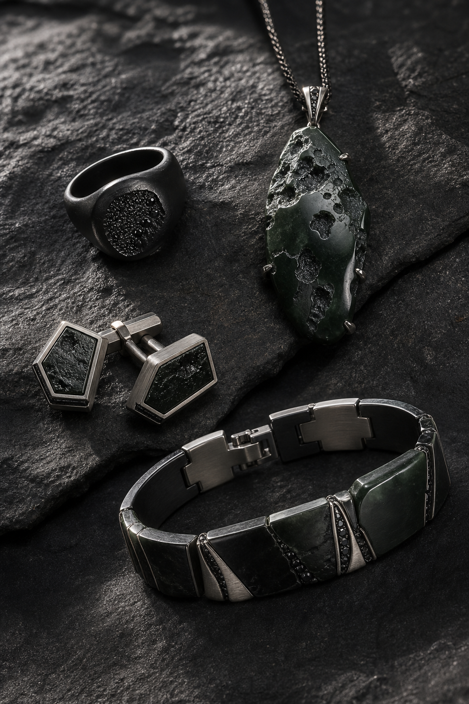
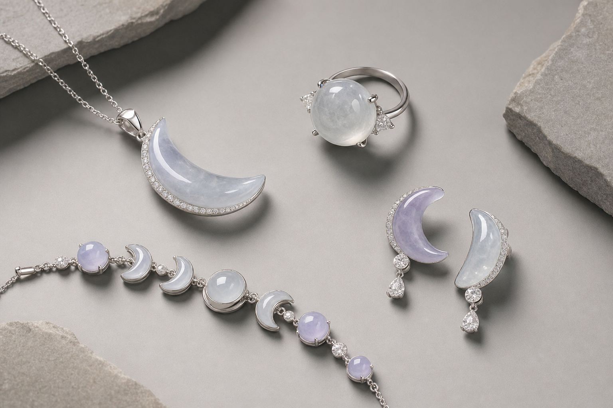

# 主題構思

最後更新：2026-08-14

用途：記錄未來可發展成產品、插畫、包裝、貼紙、吊飾或社交內容的系列主題方向。

## Future Series Concept

### Space & Moon 系列

主題定位：以太空、月相、隕石、日蝕和深空作為靈感，將翡翠的冰感、棉絮、飄花、墨色和深綠色轉化成「月光」與「宇宙岩石」兩種視覺語言。系列可以分成一柔一剛兩條支線：一條偏月光、冰透、女性化；另一條偏隕石、墨翠、中性和未來感。

參考圖：

| 概念產品 | 初步方向 | 可延伸款式 |
| --- | --- | --- |
| Meteorite / 深空隕石 | 深綠、墨翠、烏雞、灰黑花翡翠配黑色或槍灰金屬；用粗糙坑紋、碎石感、不規則幾何去表達隕石和月球表面 | 男裝/中性戒指、吊墜、手鏈牌、袖口鈕、手機繩 charm |
| Moon Phase / 月相 | 冰白、淡紫、淡青綠翡翠配銀色金屬；用新月、滿月、弦月、圓珠和弧線表達月光和月相變化 | 新月吊墜、月相手鏈、非對稱耳環、月亮戒指、小月亮 charm |

設計語言：

- 形狀：圓形、半月、新月、弧線、偏心軌道、不規則碎石形。
- 材料：冰白翡翠、淡紫翡翠、淡青綠翡翠、墨翠、烏雞、深綠飄花料。
- 金屬：925 銀、黑銠色、槍灰色、氧化銀；低成本版本可用不鏽鋼、鍍黑色配件或蠟線。
- 細節：少量 CZ 或銀珠作星點；避免大量鑽石、厚重鑲嵌和太複雜雕刻。

成本控制方向：

- HK$500 內：優先做小吊墜、蠟線手繩、簡單耳線、手機繩 charm。
- HK$500-800：可試小銀鏈月相手鏈、簡單開口戒、黑色金屬吊墜。
- 避免大面積金屬包邊、滿鑲 CZ、複雜立體月球坑紋；若要坑紋效果，先用現成帶花/棉/墨色玉料表達。

第一批可測試方向：

1. 墨翠或烏雞小件做「深空隕石」黑繩/銀鏈吊墜。
2. 淡色小件做「小月相」手鏈或耳線。
3. 一黑一白小石組成「日蝕」非對稱耳環。
4. 平安扣或甜甜圈料做「滿月 / 月環」蠟線手繩。

### 動物系列

| 主題 | 初步方向 | 可延伸款式 |
| --- | --- | --- |
| 海洋 | 清爽、透明感、流動感，可配合冰種、糯冰、淡青綠色玉件 | 鯨魚、海豚、水母、海星、螃蟹、小魚、貝殼 |
| 狗 | 親切、陪伴感、日常可愛，適合做小 charm 或節日限定 | 不同品種、表情狗、職業狗、節日狗、睡覺狗 |
| 貓 | 慵懶、神秘、柔軟，適合做吊墜、耳飾或插畫周邊 | 慵懶貓、黑貓、橘貓、魔法貓、睡覺貓 |

### 卡通人物系列

| 主題 | 初步方向 | 可延伸款式 |
| --- | --- | --- |
| 原創角色 | 建立品牌自己的小角色，可用於包裝、貼紙、IG 內容和小吊飾 | 可愛角色、搞怪角色、復古角色、奇幻角色 |
| 主題角色 | 根據節日、職業或生活情境做系列化內容 | 小廚師、小畫家、探險家、睡衣角色、節日角色 |

### 植物系列

| 主題 | 初步方向 | 可延伸款式 |
| --- | --- | --- |
| 花 | 溫柔、禮物感、女性自用，可配合淡色玉件或銀色配件 | 玫瑰、雛菊、鬱金香、向日葵、野花 |
| 南瓜 | 秋天、萬聖節、可愛季節限定，適合做短期內容或小物系列 | 萬聖節南瓜、可愛南瓜、秋天南瓜、南瓜角色 |

### 未來天文系列

| 主題 | 初步方向 | 可延伸款式 |
| --- | --- | --- |
| 未來地動說遺物 | 以冰種暖色翡翠圓牌作為「收藏星圖的天文盤」，結合日心軌道、星圖刻線、暗金光、古代學者感與未來文物感；氛圍可參考《關於地球的運動》的知識、信念、禁忌與天體運行主題，但保持原創視覺語言 | 翡翠星盤吊墜、軌道刻線吊墜、微型天文儀 charm、星圖包裝卡、黑 velvet 產品照、古書盒包裝、限量「觀測者」系列 |

設計圖紀錄：

- 原始冰種暖色翡翠吊墜：[ice-jade-pendant-base.png](../trackers/concept-renders/future-astronomy/ice-jade-pendant-base.png)
- 未來天文主題概念圖：[future-astronomical-jade-artifact.png](../trackers/concept-renders/future-astronomy/future-astronomical-jade-artifact.png)

設計備註：

- 保留暖黃綠、淡青、冰透感，避免變成鮮綠或過度 cyberpunk。
- 主要符號語言：軌道線、圓形刻度、星點、觀測儀、古書、手稿、暗金金屬件。
- 適合做偏收藏品、故事性產品照、包裝主題和 IG 系列內容。

## 使用方向

- 作為未來產品系列命名和設計發想池。
- 可先用於 IG 插畫、包裝貼紙、感謝卡或節日限定內容，測試受眾反應。
- 若反應好，再延伸成翡翠小吊飾、耳飾、手機繩 charm 或禮盒主題。

## 下一步

1. 每個大系列先選 1 個最容易測試的主題。
2. 為每個主題拆 5-10 個款式草圖方向。
3. 對照現有玉件形狀和顏色，找出可落地的第一批產品。
